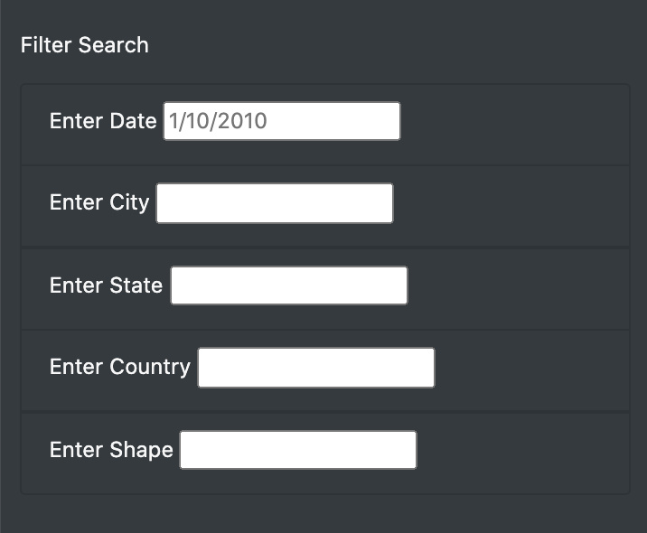
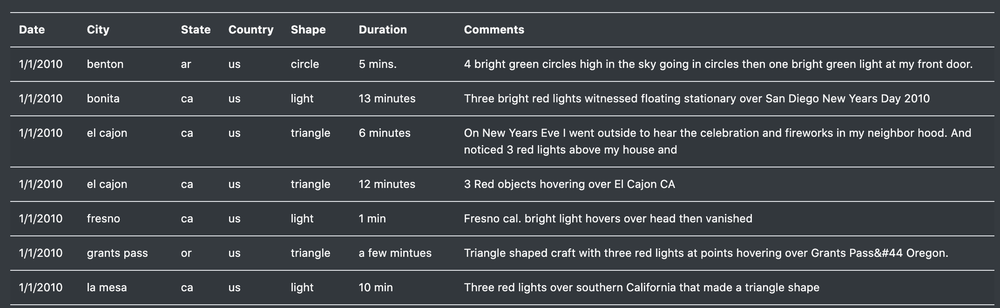

# UFOs

## Overview of Project
The purpose of this project was to develop a webpage with dynamic tables that filtered through UFO sightings by date, city, state, country, and shape. 

## Results
Simply use the Filter Search section to enter the date, city, state, country, and shape you wish to filter by. The UFO Sightings table will automatically filter.

1. Filter Search section

2. UFO Sightings table

## Summary
One drawback of this new design is that users must enter the filters correctly, without spelling and capitalization errors. Otherwise, the code will filter out all the data, leaving an empty table. To solve this, a drop down menu can be added to each of the five filters under the Filter Search section. Such feature would remove input errors since the user would have a pre-defined, pre-tested set of filter selections to choose from. To improve the Filter Search section even further, multiple filter selections can be enabled within each of the five filters. 

